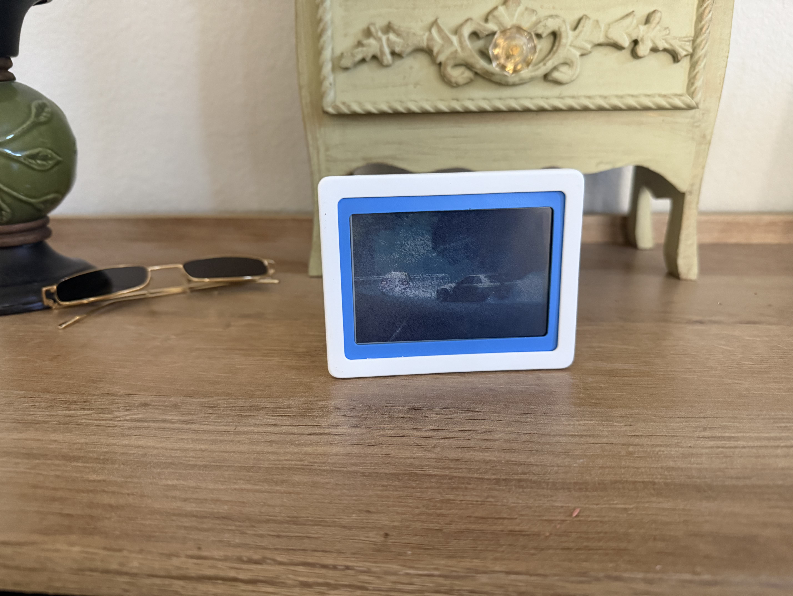
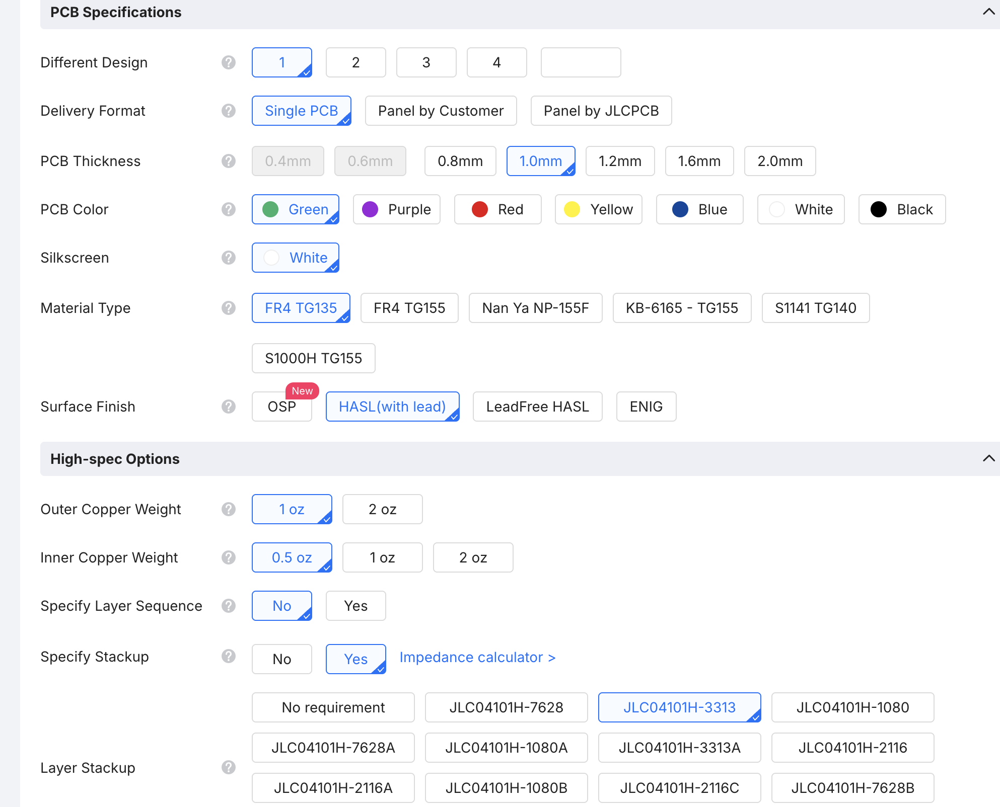

# StickyPix

StickyPix is a small, rechargeable e-paper picture frame that lets you send
images from a phone or desktop app over Bluetooth Low Energy. The same product
family supports a four-gray black-and-white display and a six-color display.



## What is in this repository?

StickyPix is developed as a complete hardware and software product:

| Area | Contents |
| --- | --- |
| App | Flutter image editor, dithering previews, device management, and BLE image transfer |
| Firmware | Zephyr-based firmware for four-gray and six-color display variants |
| Hardware | KiCad schematics, PCBs, fabrication outputs, and bills of materials |
| Enclosure | Blender source files and printable STL parts for the bezel, rear shell, inner enclosure, and kickstand |
| Images | Prototype photos and product renders |

## How it works

1. Choose an image in the Flutter app.
2. Crop, rotate, and adjust the image for the selected device.
3. The app converts the image to the display's limited palette using dithering.
4. The processed framebuffer is sent to the device over BLE.
5. The device refreshes the e-paper panel and returns transfer progress and battery information.

The image pipeline currently supports:

- Four-gray output for the black-and-white display variant.
- Six-color output for black, white, yellow, red, blue, and green.
- Portrait and landscape editing for the six-color device.
- Packed framebuffer transfer sized for the target panel.

## Display variants

- [Six-color display / Spectra 6 panel](https://www.ebay.com/itm/267508191177?var=567305393025)
- [Black-and-white display panel](https://www.good-display.com/product/613.html)

The linked vendor pages are the reference parts for the current hardware
designs. Check the vendor documentation for the latest availability and
electrical specifications before ordering.

## JLCPCB fabrication settings

For the current PCB designs, I use the following JLCPCB configuration as the
fabrication reference:

| Setting | Value |
| --- | --- |
| Design | 1 |
| Delivery format | Single PCB |
| PCB thickness | 1.0 mm |
| PCB color | Green |
| Silkscreen | White |
| Material | FR4 TG135 |
| Surface finish | HASL (with lead) |
| Outer copper | 1 oz |
| Inner copper | 0.5 oz |
| Specify layer sequence | No |
| Specify stackup | Yes |
| Layer stackup | JLC04101H-3313 |



Treat this as the current ordering reference, not a guarantee that every board
revision uses the same stackup. Recheck the board layer count, dimensions, and
JLCPCB options before placing an order.

## Enclosure

The enclosure is split into a front bezel, rear shell, inner cardstock/support
piece, and kickstand. The repository includes both the editable Blender model
and exported STL files.


## Repository layout

```text
Images/                         Prototype photos
3D Model/                       Printable enclosure STL files
Hardware/24p_bw_3p5/            Black-and-white KiCad design
Hardware/50p_spectra6_4/        Six-color KiCad design
Firmware/4GrayFinal/             Four-gray Zephyr firmware
Firmware/6ColorFinal/            Six-color Zephyr firmware
Flutter App/frontend/sticky_pix/ Flutter application
Manufacturing/                  Manufacturing files and BOM
```

## Project status

StickyPix is an active hardware prototype. The app, firmware, PCB designs, and
enclosure are included for development and iteration; dimensions, pinouts,
image timings, and manufacturing outputs may change.

## Development notes

The Flutter application is in `Flutter App/frontend/sticky_pix`. The firmware
projects use Zephyr and are kept separate so the four-gray and six-color panel
drivers can evolve independently. Build-tool-generated files and local SDK
paths should remain uncommitted.
